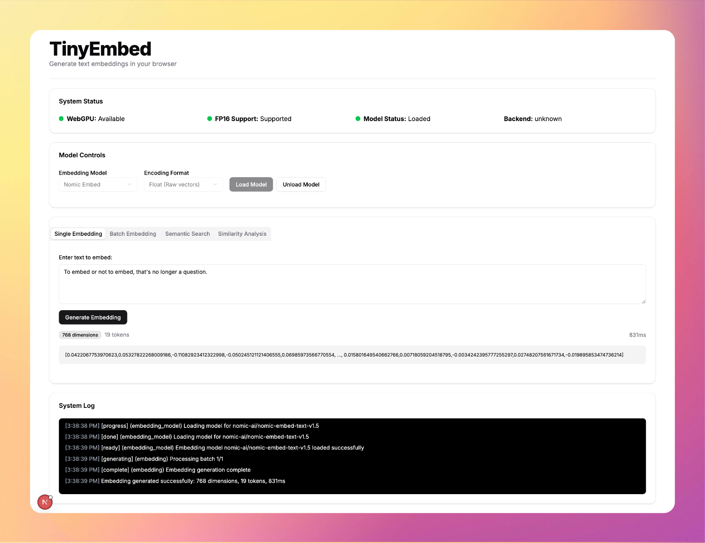

<div align="center">
  <h1> TinyEmbed </h1>
  <p>
    <a href="https://github.com/wizenheimer/tinylm"><strong>Learn More »</strong></a>
  </p>
</div>



TinyEmbed lets you create text embeddings, perform semantic searches, and analyze text similarity without any backend server. All processing happens locally, right within your browser.

## Features

- **Single Text Embedding**: Generate embeddings for individual texts
- **Batch Embedding**: Process multiple texts at once
- **Semantic Search**: Create a corpus of texts and search by meaning
- **Similarity Analysis**: Compare two texts and analyze their semantic similarity
- **Local Processing**: All computation runs in your browser
- **No API Keys**: No external API services or keys required

## Technical Stack

- **Next.js** with App Router and TypeScript
- **TinyLM** for embedding generation
- **shadcn/ui** for components
- **Tailwind CSS** for styling
- **WebGPU** (optional) for hardware acceleration

## Browser Requirements

- Modern browser with WebGPU support for full performance (Chrome 113+, Edge 113+, or other Chromium browsers)
- Falls back to WebGL when WebGPU is unavailable

## Getting Started

### Installation

```bash
# Clone the repository
git clone https://github.com/wizenheimer/tinyembed.git
cd tinyembed

# Install dependencies
npm install
```

### Development

```bash
# Start the development server
npm run dev
```

### Production Build

```bash
# Build for production
npm run build

# Start the production server
npm start
```

## Usage Guide

### 1. Load the Embedding Model

- Select the embedding model from the dropdown (currently only Nomic Embed is supported)
- Choose the encoding format (Float for raw vectors or Base64 for compact storage)
- Click "Load Model" and wait for the loading process to complete
- The status indicators will show you the current state of the model and system

### 2. Generate Embeddings

#### Single Embedding

- Enter text in the input field
- Click "Generate Embedding"
- View the resulting embedding vector and metadata

#### Batch Embedding

- Enter multiple texts, one per line
- Click "Generate Batch Embeddings"
- View the results for the entire batch

### 3. Semantic Search

- Add documents one by one to create a searchable corpus
- Enter a search query
- Click "Search" to find semantically similar documents
- Results will be ranked by similarity

### 4. Similarity Analysis

- Enter two texts to compare
- Click "Compare Texts"
- View the similarity score and interpretation

## Performance Notes

- WebGPU acceleration provides the best performance, especially for larger embedding models
- Loading models can take some time depending on your internet connection (models are downloaded the first time)
- Processing times improve significantly after the initial runs
- For using vector search over HNSW index, try out [tinkerbird](https://github.com/wizenheimer/tinkerbird) library.

## Attribution

This project uses:

- [TinyLM](https://github.com/wizenheimer/tinylm) for browser-based ML inference
- [Nomic Embed](https://huggingface.co/nomic-ai/nomic-embed-text-v1.5) text embedding model
- [shadcn/ui](https://ui.shadcn.com/) for UI components
